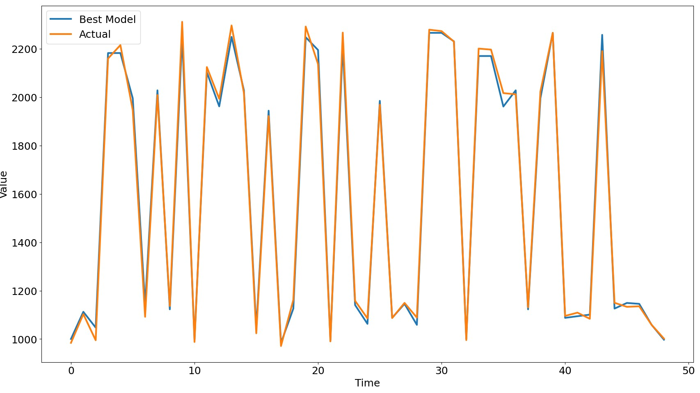

# Time-Series Regressor

A lightweight and modular framework for transforming raw datasets into supervised learning windows and training regression models on multivariate time series.

## Features
- Sliding-window generation for multivariate time series
- Clean preprocessing utilities (zero filtering, datetime normalization)
- Flexible data loader supporting CSV/XLSX
- Automatic feature/target mapping
- Easy integration with scikit-learn models

## Project Structure
```
project/
├── main.py
├── utils/
│   ├── data_loader.py
│   ├── preprocessing.py
│   └── time_series.py
├── models/
│   └── regressor.py
├── data/
│   └── infy_stock.csv
└── README.md
```

## Installation
```bash
pip install -r requirements.txt
```

## Usage Example
```python
python main.py
```



## Application Example

An application of this framework can be seen in the study "*[Transforming personalized weight forecasting: From the Personalized Metabolic Avatar to the Generalized Metabolic Avatar](https://doi.org/10.1016/j.compbiomed.2025.109879)*". The model supports predictive analytics similar to those used in the PMA/GMA research pipeline, enabling generalized metabolic forecasting without individual calibration.

## License
MIT License
